# CoralMux Relay

[🇺🇸 English](README.md)

종단간 암호화를 지원하는 NAT 우회 WebSocket 릴레이입니다. 포트포워딩 없이 두 WebSocket 피어를 연결합니다.

```
클라이언트 A ──WSS──▶ CoralMux Relay ◀──WSS── 클라이언트 B
  (아웃바운드)           (릴레이)          (아웃바운드)
```

양쪽 모두 **아웃바운드** 연결을 사용합니다. NAT/방화벽 뒤에서도 동작합니다.

## 주요 기능

- 🔐 **종단간 암호화** — X25519 + AES-256-GCM (릴레이가 메시지를 읽을 수 없음)
- 🌐 **제로 설정 NAT 우회** — 양쪽 모두 아웃바운드 WebSocket
- ⚡ **스트리밍** — 실시간 토큰 단위 전달
- 📊 **속도 제한** — 연결별 + 일/월 대역폭 쿼터
- 📎 **바이너리 페이로드** — 메시지당 최대 5MB
- 🔒 **자동 TLS** — Let's Encrypt 연동
- 📦 **단일 바이너리** — 의존성 없음

## 빠른 시작

```bash
# 다운로드
curl -sSL https://raw.githubusercontent.com/coralmux/relay/main/install.sh | sh

# 실행
coralmux-relay -addr :8080 -admin-key my-secret

# 페어링 토큰 생성
curl -X POST http://localhost:8080/api/v1/pair \
  -H "X-Admin-Key: my-secret"
# → {"token": "oc_pair_a1b2c3d4..."}
```

토큰을 두 피어에 공유합니다. 같은 토큰으로 릴레이에 연결하면 자동으로 페어링됩니다.

### 프로덕션 (자동 TLS)

```bash
coralmux-relay -domain relay.example.com -admin-key $(openssl rand -hex 16)
```

## 구조

```mermaid
graph LR
    subgraph A["클라이언트 A (NAT)"]
        PeerA[피어 A]
    end

    subgraph Cloud["☁️ 클라우드"]
        Relay[CoralMux Relay]
    end

    subgraph B["클라이언트 B (NAT)"]
        PeerB[피어 B]
    end

    PeerA -- "WSS (아웃바운드)" --> Relay
    Relay -- "WSS (아웃바운드)" --- PeerB

    style Relay fill:#f9a825,stroke:#f57f17,color:#000
    style PeerA fill:#42a5f5,stroke:#1565c0,color:#fff
    style PeerB fill:#66bb6a,stroke:#2e7d32,color:#fff
```



릴레이는 암호화된 데이터만 전달합니다. 메시지를 복호화할 수 없습니다.

### 연결 흐름

```mermaid
sequenceDiagram
    participant A as 클라이언트 A
    participant R as 릴레이
    participant B as 클라이언트 B

    Note over A,B: 1. 페어링
    A->>R: 연결 (토큰)
    B->>R: 연결 (같은 토큰)
    R-->>A: 페어링 완료 ✅
    R-->>B: 페어링 완료 ✅
    A->>B: 🔑 키 교환 (X25519)

    Note over A,B: 2. 통신
    A->>R: 암호화된 메시지
    R->>B: 전달 (읽을 수 없음)
    B->>R: 암호화된 응답
    R->>A: 전달 (읽을 수 없음)
```



## E2E 암호화

두 피어가 연결되면:

1. `key_exchange` 메시지로 X25519 공개키 교환
2. ECDH + HKDF-SHA256으로 공유 비밀키 유도
3. 모든 메시지를 AES-256-GCM으로 암호화

```json
{
  "type": "chat.send",
  "payload": {
    "enc": true,
    "ciphertext": "base64...",
    "nonce": "base64..."
  }
}
```

전체 프로토콜 명세는 [PROTOCOL.md](PROTOCOL.md)를 참고하세요.

## 속도 제한

| 제한 | 기본값 |
|------|--------|
| 최대 메시지 크기 | 5 MB |
| 메시지/분 (피어당) | 30 / 120 |
| 일일 대역폭/토큰 | 500 MB |
| 월간 대역폭/토큰 | 10 GB |

## 소스에서 빌드

```bash
git clone https://github.com/coralmux/relay.git
cd relay
make build          # 네이티브 바이너리
make build-all      # 전체 플랫폼 (dist/)
```

## 배포

### systemd
```bash
sudo cp coralmux-relay /usr/local/bin/
sudo cp deploy/systemd/coralmux-relay.service /etc/systemd/system/
sudo systemctl enable --now coralmux-relay
```

### Docker
```bash
docker run -p 443:443 coralmux/relay \
  -domain relay.example.com -admin-key your-secret
```

## 라이선스

MIT
