# CoralMux Relay

NAT-transparent WebSocket relay with end-to-end encryption. Connect any two WebSocket peers without port forwarding.

```
Client A ──WSS──▶ CoralMux Relay ◀──WSS── Client B
 (outbound)           (relay)         (outbound)
```

Both sides make **outbound** connections. Works behind any NAT/firewall.

## Features

- 🔐 **End-to-end encryption** — X25519 + AES-256-GCM (relay cannot read messages)
- 🌐 **Zero-config NAT traversal** — outbound WebSocket from both ends
- ⚡ **Streaming** — real-time token-by-token delivery
- 📊 **Rate limiting** — per-connection + daily/monthly bandwidth quota
- 📎 **Binary payloads** — up to 5MB per message
- 🔒 **Auto TLS** — Let's Encrypt integration
- 📦 **Single binary** — no dependencies

## Quick Start

```bash
# Download
curl -sSL https://raw.githubusercontent.com/coralmux/relay/main/install.sh | sh

# Run
coralmux-relay -addr :8080 -admin-key my-secret

# Create pairing token
curl -X POST http://localhost:8080/api/v1/pair \
  -H "X-Admin-Key: my-secret"
# → {"token": "oc_pair_a1b2c3d4..."}
```

Share the token with both peers. They connect to the relay with the same token and get paired automatically.

### Production (auto TLS)

```bash
coralmux-relay -domain relay.example.com -admin-key $(openssl rand -hex 16)
```

## Architecture

```mermaid
graph LR
    subgraph A["Client A (NAT)"]
        PeerA[Peer A]
    end

    subgraph Cloud["☁️ Cloud"]
        Relay[CoralMux Relay]
    end

    subgraph B["Client B (NAT)"]
        PeerB[Peer B]
    end

    PeerA -- "WSS (outbound)" --> Relay
    Relay -- "WSS (outbound)" --- PeerB

    style Relay fill:#f9a825,stroke:#f57f17,color:#000
    style PeerA fill:#42a5f5,stroke:#1565c0,color:#fff
    style PeerB fill:#66bb6a,stroke:#2e7d32,color:#fff
```



The relay only sees encrypted blobs. It forwards messages but cannot decrypt them.

### Connection Flow

```mermaid
sequenceDiagram
    participant A as Client A
    participant R as Relay
    participant B as Client B

    Note over A,B: 1. Pairing
    A->>R: Connect (token)
    B->>R: Connect (same token)
    R-->>A: Paired ✅
    R-->>B: Paired ✅
    A->>B: 🔑 Key Exchange (X25519)

    Note over A,B: 2. Communication
    A->>R: Encrypted message
    R->>B: Forward (can't read)
    B->>R: Encrypted reply
    R->>A: Forward (can't read)
```



## E2E Encryption

When both peers connect:

1. Exchange X25519 public keys via `key_exchange` message
2. Derive shared secret using ECDH + HKDF-SHA256
3. Encrypt all messages with AES-256-GCM

```json
{
  "type": "chat.send",
  "payload": {
    "enc": true,
    "ciphertext": "base64...",
    "nonce": "base64..."
  }
}
```

See [PROTOCOL.md](PROTOCOL.md) for full protocol specification.

## Rate Limits

| Limit | Default |
|-------|---------|
| Max message size | 5 MB |
| Messages/min (per peer) | 30 / 120 |
| Daily bandwidth/token | 500 MB |
| Monthly bandwidth/token | 10 GB |

## Build from Source

```bash
git clone https://github.com/coralmux/relay.git
cd relay
make build          # Native binary
make build-all      # All platforms (dist/)
```

## Deployment

### systemd
```bash
sudo cp coralmux-relay /usr/local/bin/
sudo cp deploy/systemd/coralmux-relay.service /etc/systemd/system/
sudo systemctl enable --now coralmux-relay
```

### Docker
```bash
docker run -p 443:443 ghcr.io/coralmux/relay \
  -domain relay.example.com -admin-key your-secret
```

## License

MIT
