# CoralMux Relay

NAT-transparent WebSocket relay for AI agents. Connect your phone to your own AI server without port forwarding.

```
📱 Phone ──WSS──▶ CoralMux Relay ◀──WSS── 🤖 Agent
   (outbound)         (cloud)         (outbound)
```

Both sides make **outbound** connections. Works behind any NAT/firewall.

## Works With

| Agent Frameworks | Mobile Clients |
|------------------|----------------|
| [OpenClaw](https://github.com/openclaw/openclaw) | Android / iOS |
| LangChain | React Native |
| AutoGPT | Flutter |
| CrewAI | Web |
| Your own bot | Any WebSocket client |

Protocol-based — if it speaks WebSocket + JSON, it works.

## Quick Install

```bash
curl -sSL https://raw.githubusercontent.com/openclaw/coralmux/main/install.sh | sh
```

Or download from [Releases](https://github.com/openclaw/coralmux/releases).

## Features

- 🔐 **End-to-end encryption** — X25519 + AES-256-GCM (relay cannot read messages)
- 🌐 **Zero-config NAT traversal** — outbound WebSocket from both ends
- ⚡ **Streaming** — real-time token-by-token response delivery
- 📊 **Rate limiting** — per-connection + daily/monthly bandwidth quota
- 📎 **Multimodal** — image attachments up to 5MB
- 🔒 **Auto TLS** — Let's Encrypt integration
- 📦 **Single binary** — no dependencies

## Usage

### Development (no TLS)
```bash
coralmux-relay -addr :8080 -admin-key my-secret
```

### Production (auto TLS)
```bash
coralmux-relay -domain relay.example.com -admin-key $(openssl rand -hex 16)
```

### Create Pairing Token
```bash
curl -X POST http://localhost:8080/api/v1/pair \
  -H "X-Admin-Key: my-secret"

# Response: {"token": "oc_pair_a1b2c3d4..."}
```

Share this token with your phone app and agent to pair them.

## Architecture

```mermaid
graph LR
    subgraph Phone["📱 Phone (NAT)"]
        App[Mobile App]
    end

    subgraph Cloud["☁️ Cloud"]
        Relay[CoralMux Relay]
    end

    subgraph Home["🏠 Home (NAT)"]
        Agent[Bridge Agent]
        GW[AI Gateway]
        LLM["🧠 LLM API"]
    end

    App -- "WSS (outbound)" --> Relay
    Relay -- "WSS (outbound)" --- Agent
    Agent -- "WS (localhost)" --> GW
    GW -- "HTTPS" --> LLM

    style Relay fill:#f9a825,stroke:#f57f17,color:#000
    style App fill:#42a5f5,stroke:#1565c0,color:#fff
    style Agent fill:#66bb6a,stroke:#2e7d32,color:#fff
    style GW fill:#ab47bc,stroke:#6a1b9a,color:#fff
    style LLM fill:#ef5350,stroke:#c62828,color:#fff
```



**Both sides make outbound connections** — no port forwarding needed.

The relay only sees encrypted blobs. It forwards messages but cannot decrypt them.

### Data Flow

```mermaid
sequenceDiagram
    participant P as 📱 Phone
    participant R as ☁️ Relay
    participant A as 🔌 Agent
    participant G as ⚙️ Gateway
    participant L as 🧠 LLM

    Note over P,A: 1. Pairing (one-time)
    P->>R: Connect (token)
    A->>R: Connect (same token)
    R-->>P: Paired ✅
    R-->>A: Paired ✅
    P->>A: 🔑 Key Exchange (X25519)

    Note over P,L: 2. Chat Message
    P->>R: Encrypted message
    R->>A: Forward (can't read)
    A->>G: Decrypt → chat.send
    G->>L: API call
    L-->>G: Stream tokens
    G-->>A: Stream response
    A-->>R: Encrypt → forward
    R-->>P: Encrypted stream
```



## E2E Encryption

When both peers connect:

1. Exchange X25519 public keys via `key_exchange` message
2. Derive shared secret using ECDH + HKDF-SHA256
3. Encrypt all chat messages with AES-256-GCM

```json
{
  "type": "chat.send",
  "payload": {
    "enc": true,
    "ciphertext": "base64...",
    "nonce": "base64..."
  }
}
```

See [PROTOCOL.md](PROTOCOL.md) for full protocol specification.

## Rate Limits

| Limit | Value |
|-------|-------|
| Max message size | 5 MB |
| Phone messages/min | 30 |
| Agent messages/min | 120 |
| Daily bandwidth/token | 500 MB |
| Monthly bandwidth/token | 10 GB |

## Build from Source

```bash
git clone https://github.com/openclaw/coralmux.git
cd coralmux
make build          # Native binary
make build-all      # All platforms (dist/)
```

## Deployment

### systemd
```bash
sudo cp coralmux-relay /usr/local/bin/
sudo cp deploy/systemd/coralmux-relay.service /etc/systemd/system/
sudo systemctl enable --now coralmux-relay
```

### Docker
```bash
docker run -p 443:443 ghcr.io/openclaw/coralmux \
  -domain relay.example.com -admin-key your-secret
```

### Oracle Cloud Free Tier (Recommended)
ARM Ampere A1 (4 cores, 24GB RAM) is **free forever**. Perfect for running your own relay.

## Public Relay

Don't want to host your own? Use the public relay:

```
wss://relay.coralmux.com/ws
```

Rate limits apply. For production use, we recommend self-hosting.

## License

MIT

---

Made with ☕ by [OpenClaw](https://github.com/openclaw)
